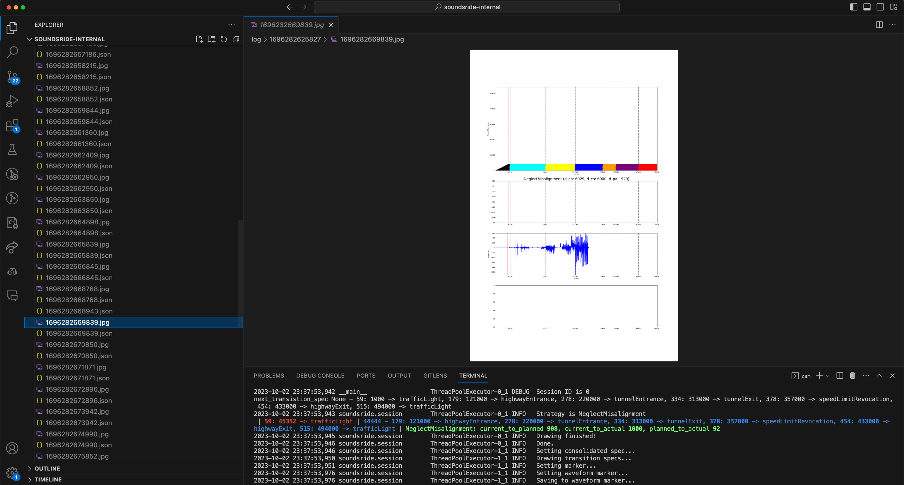

# SoundsRide: Affordance-Synchronized Music Mixing for In-Car Audio Augmented Reality [Server]

[Mohamed Kari<sup>1,2</sup>](https://mkari.de/), [Tobias Grosse-Puppendahl<sup>1</sup>](http://grosse-puppendahl.com/), Alexander Jagaciak<sup>1</sup>, David Bethge<sup>1</sup>, Reinhard Schütte<sup>2</sup>, [Christian Holz<sup>3</sup>](https://www.christianholz.net)<br/>

<sup>1</sup> [Porsche AG](https://porsche.com/), Stuttgart, Germany <br/>
<sup>2</sup> University of Duisburg-Essen, Germany <br/>
<sup>3</sup> [Sensing, Interaction & Perception Lab](https://siplab.org), Department of Computer Science, ETH Zürich, Switzerland <br/>

---

SoundsRide runs the mixing server on MacOS and the localization client on iOS.
This repo contains the mixing server. 
For the localization client, refer to [the iOS repo](https://github.com/MohamedKari/soundsride-ios).
## Preparations

Install dependencies:
```sh
brew install portaudio
python -m venv .venv
source .venv/bin/activate
pip install -r requirements.txt
```

Place the following songs into the `./tests/data/` directory:
- `animals.mp3` (Martin Garrix, 05:02)
- `drink-up-me-hearties.mp3` (Hans Zimmer, 04:29)
- `requiem-for-a-tower.mp3` (Clint Mansell, 04:10)
- `music.mp3` (John Miles, 05:52)
- `river-flows-in-you.mp3` (Yiruma, 03:29)
- `tsunami.mp3` (DVBSS & Borgeous, 03:57)
- `shot-me-down.mp3` (David Guetta ft. Skylar Grey, 03:09)
- `underground.mp3` (Lindsey Stirling, 04:25)

These mp3 along with the transition specs will be loaded into the song snippet database. 

## Try out basic component functionalities
### try out the hot-swappable player
```sh
python -m soundsride.player $PATH_TO_MP3 
# continuous playback
```

### try playback visualization
```sh
python -m soundsride.viz_player $PATH_TO_MP3
# starting playback, output `latest_audio.jpg` in the current folder and continuoulsy overwrite it
```

### try the transition visualizer
```sh
python -m soundsride.canvas.transition_spec_canvas $PATH_TO_MP3
# outputs `transitiion_*.jpg` into the current folder, indicating the transition markers
```

## Build the service proto buffer code and spin up the server
Communication is implemented via proto-buffer-based gRPC. 

```sh
make python-protos
python -m soundsride.service.server 8888
```

As soon as the client starts sending localization data, the server will mix music accordingly, write the received localization data as well as the system state overview visualizations to the `log/$TIMESTAMP` directory.

